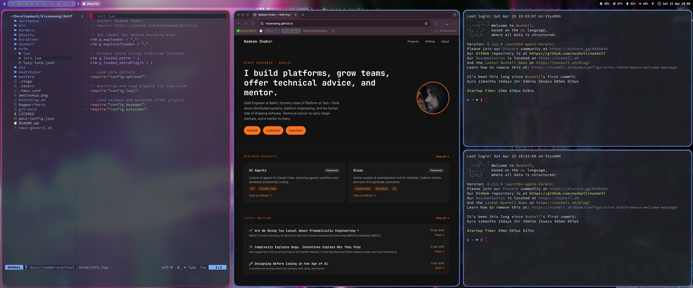
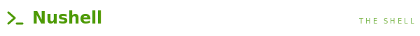
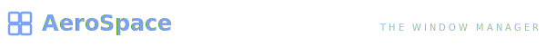
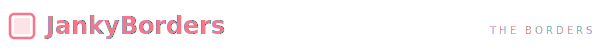

<div align="center">


### a quietly opinionated macOS workflow

_Nadeem Shabir · Staff Engineer at [BibliU](https://bibliu.com)_



[](https://neovim.io)
[](https://www.nushell.sh)
[](https://github.com/nikitabobko/AeroSpace)
[](https://github.com/FelixKratz/SketchyBar)
[](https://ghostty.org)
[](https://wezfurlong.org/wezterm/)
[](https://karabiner-elements.pqrs.org)
[](#)

**[Editor](#editor) · [Shell](#shell) · [Window Manager](#window-manager) · [Status Bar](#status-bar) · [Terminals](#terminals) · [Hyper Key](#hyper-key) · [Borders](#borders) · [About](#about)**

</div>

> A keyboard-driven macOS setup built around **Neovim (Lua)**, **Nushell**, **AeroSpace**, and **SketchyBar**. Tokyo Night palette, JetBrains Mono everywhere, one Hyper key to rule them all.

## The Stack

| Layer           | Tool                | Why                                                 |
| --------------- | ------------------- | --------------------------------------------------- |
| Editor          | Neovim · Lua        | Native LSP, lazy.nvim, no VimScript                 |
| Shell           | Nushell             | Structured data, real types, sane completions      |
| Window manager  | AeroSpace           | Tiling, persistent workspaces, scriptable          |
| Status bar      | SketchyBar          | Per-pixel control; no Apple menu compromises       |
| Terminals       | Ghostty + WezTerm   | GPU-accelerated, identical Catppuccin look         |
| Keyboard        | Karabiner-Elements  | `§` → Hyper                                         |
| Borders         | JankyBorders        | Active/inactive window outlines                     |
| History         | Atuin + zoxide      | Encrypted shared history; frecency `cd`            |

## Install

```bash
git clone https://github.com/kiyanwang/dotfiles ~/dotfiles
cd ~/dotfiles
./bootstrap.sh
```

`bootstrap.sh` installs Homebrew, every tool above, nvm, and the Rust toolchain — then symlinks each subdirectory into the place its tool expects to find it:

```
dotfiles/nushell/    → ~/Library/Application Support/nushell/
dotfiles/nvim/       → ~/.config/nvim/
dotfiles/aerospace/  → ~/.aerospace.toml
dotfiles/ghostty/    → ~/.config/ghostty/
dotfiles/karabiner/  → ~/.config/karabiner/
```

Karabiner-Elements and AeroSpace need accessibility permissions in **System Settings → Privacy & Security** before they'll wake up properly.

<h2 id="editor"></h2>

VimScript and CoC are out. The whole config is Lua, lazy-loaded, and uses Neovim 0.11's native LSP API.

- **lazy.nvim** plugin manager with a committed lockfile
- **Native LSP** via `vim.lsp.config` / `vim.lsp.enable` — no CoC
- **Mason** auto-installs servers: `ts_ls`, `lua_ls`, `jsonls`, `yamlls`, `bashls`, `eslint`, `intelephense`, `dockerls`, `ansiblels`, `cssls`, `html`. Nushell LSP via `nu --lsp`.
- **nvim-cmp** + LuaSnip with the supertab pattern
- **Telescope** (fzf-native, ui-select, undo) for anything findable
- **Conform** formats on save — prettier, stylua, php-cs-fixer
- **Treesitter** for syntax + textobjects, **Gitsigns**, **Flash**, **Which-Key**
- **Catppuccin Mocha**, transparent, **alpha-nvim** dashboard

<details>
<summary><b>Keymap</b></summary>

<br>

| Keys              | What                                  |
| ----------------- | ------------------------------------- |
| `jj`              | exit insert mode                      |
| `,w`              | save                                  |
| `,ff` / `,fg`     | find file / live grep                 |
| `//` / `??`       | live grep / word under cursor         |
| `gd` / `gr` / `K` | definition / references / hover       |
| `,rn` / `,a`      | rename / code actions                 |
| `[d` / `]d`       | previous / next diagnostic            |
| `,gg`             | lazygit in a new tab                  |
| `Tab`             | completion (supertab)                 |
| `Ctrl-h/j/k/l`    | move between splits and tmux panes    |

</details>

<h2 id="shell"></h2>

Bash is gone. Everything is structured data — `ls` returns rows, `ps` returns rows, `http get` returns parsed JSON. Pipelines read like queries:

```nu
ps | where cpu > 5 | sort-by cpu --reverse | first 10
```

- **zoxide** for `z` jumps
- **atuin** for shared, encrypted, fzf-style history
- **eza** powering `ll` and `tree`
- Homebrew + nvm's default Node bin on `PATH` (set in `env.nu` so zoxide init can find them)
- `vi` / `vim` / `view` all alias to `nvim` — no muscle memory tax

<details>
<summary><b>Aliases worth knowing</b></summary>

<br>

| Alias / command | Does                                                      |
| --------------- | --------------------------------------------------------- |
| `ll [path]`     | `ls -a` sorted by type and name                           |
| `tree`          | `eza --tree --level=2 --long --icons --git`               |
| `whatsmyip`     | `http get ipecho.net/plain`                               |
| `clc`           | `claude --allow-dangerously-skip-permissions --chrome`    |

</details>

<h2 id="window-manager"></h2>

Tiling, scriptable, no SIP disable. Workspaces **1–6** live on the main monitor, **7–9** on the secondary. They persist whether they hold windows or not. Mouse follows focus across monitors.

> **Why `ctrl-alt-cmd-shift` and not plain `alt-1..9`?** UK ISO keyboards type `#` on `alt-3`. So workspace switching moved to Hyper (via the `§` key), freeing `alt-3` to actually type a hash.

<details>
<summary><b>Keymap</b></summary>

<br>

| Keys                          | Action                                            |
| ----------------------------- | ------------------------------------------------- |
| `alt-h/j/k/l`                 | focus left / down / up / right                    |
| `alt-shift-h/j/k/l`           | move window                                       |
| `alt-shift-1..9`              | move window to workspace                          |
| `ctrl-alt-cmd-shift-1..9`     | switch workspace (Hyper-1..9 via Karabiner)       |
| `alt-tab`                     | last workspace                                    |
| `alt-y`                       | toggle floating ↔ tiling                          |
| `alt-/` / `alt-,`             | tiles ↔ accordion layout                          |
| `alt-f`                       | fullscreen                                        |
| `alt-=` / `alt--`             | resize                                            |
| `alt-enter`                   | new Ghostty window                                |
| `alt-shift-enter`             | new WezTerm window                                |
| `alt-b`                       | new Chrome window                                 |
| `alt-shift-;`                 | enter service mode (`r` reset, `f` float, `←` close-others, joins) |

</details>

<h2 id="status-bar"></h2>

Apple's menu bar is non-negotiable about layout. SketchyBar isn't.

- Workspace pills, grouped: `[ 7 8 9 │ 1 2 3 4 5 6 ]`. Active workspace highlights on whichever monitor it lives on.
- Front-app pill with the app's icon glyph (sketchybar-app-font).
- Volume slider on hover, scroll-to-adjust, click to open Sound settings.
- Mic mute toggle, battery, RAM, CPU.
- Clock formatted `Thu 2 Apr · 14:32`.
- Tokyo Night palette, blurred background, rounded brackets.

Workspace updates trigger from AeroSpace via `sketchybar --trigger aerospace_workspace_change`.

<h2 id="terminals"></h2>

Same face on both. **Catppuccin Macchiato**, **SauceCodePro Nerd Font**, **80% opacity with blur**, **blinking red block cursor**, hidden titlebar.

- `alt-enter` → new **Ghostty** window (via osascript so it actually opens a new window, not just focuses)
- `alt-shift-enter` → new **WezTerm** window

Ghostty is the daily driver. WezTerm comes out for SSH multiplexing or Lua-scripted layouts.

<h2 id="hyper-key"></h2>

The trick: I never use `§` (the section sign). On UK ISO Macs it sits where US keyboards put backtick. Karabiner remaps it to **Hyper = `ctrl + opt + shift + cmd`** — a chord nothing else binds.

- **Tap** `§` → `` ` ``  (you still get a backtick)
- **Hold** `§` → Hyper modifier

Works on the Keychron and the built-in MacBook ISO keyboard — the laptop reports `§` as `non_us_backslash`, so there's a device-scoped manipulator for that case.

<h2 id="borders"></h2>

Round corners. **Active red** `#f7768e`. **Inactive blue** `#7aa2f7`. Subtle — the sort of thing you only stop noticing because it's always right.

## Aesthetic

|     | Token       | Hex                                          |
| --- | ----------- | -------------------------------------------- |
|  | bg        | `#1a1b26` Tokyo Night                  |
|  | accent    | `#7aa2f7` blue                         |
|  | highlight | `#f7768e` salmon                       |
|  | site      | `#ff8400` orange (kiyanwang.github.io) |

Code in **JetBrains Mono**, terminals in **SauceCodePro Nerd Font**.

<a id="about"></a>
## About

Built and maintained by **Nadeem Shabir** — Staff Engineer at [BibliU](https://bibliu.com). Platform builder, team grower, occasional startup advisor.

→ [kiyanwang.github.io](https://kiyanwang.github.io)
→ [github.com/kiyanwang](https://github.com/kiyanwang)

MIT — see [LICENSE](LICENSE).
